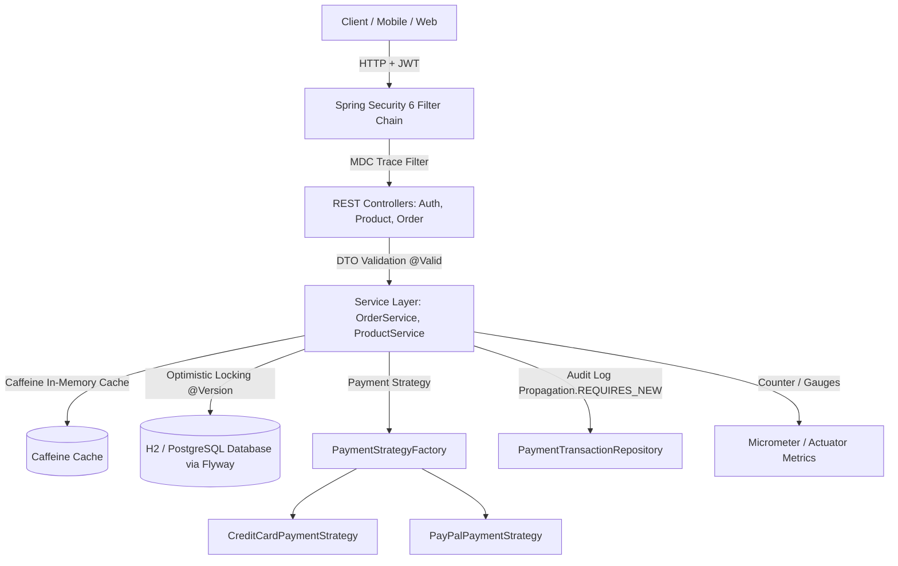

# OrderPulse ⚡
### Production-Grade Spring Boot 3 + Kotlin Backend for Technical Interviews

OrderPulse is a high-concurrency order processing and payment orchestration engine built with **Spring Boot 3.3** and **Kotlin 1.9+**. It is purposefully engineered as a reference architecture to prepare backend engineers for technical interviews from Junior to Senior/Lead levels.

---

## 🚀 Key Architectural Highlights

- **Clean Layered Architecture**: Strict separation of concerns across Domain, Service, Repository, Security, and API controllers.
- **Solving Kotlin + JPA Gotchas**: Safe entity modeling avoiding `data class` traps, resolving equals/hashCode lifecycle anomalies, and eliminating `toString()` recursion.
- **High Concurrency & Race Conditions**: Optimistic locking via `@Version` to prevent overselling inventory during peak traffic / flash sales.
- **Clean Exception Handling**: Native Spring 6 / Boot 3 implementation of **RFC 7807 ProblemDetail** with MDC distributed trace correlation.
- **Design Patterns in Practice**:
  - **Strategy Pattern** for multi-provider payment processing (`CreditCardPaymentStrategy`, `PayPalPaymentStrategy`).
  - **Factory Pattern** leveraging Spring Dependency Injection.
  - **Extension Functions** for clean, idiomatic DTO-to-Domain mapping.
- **Security**: Spring Security 6 with stateless JWT authentication, password hashing with BCrypt, and Role-Based Access Control (`@PreAuthorize`).
- **Observability**: Spring Boot Actuator with custom **Micrometer metrics** (`orderpulse.orders.placed.total`, `orderpulse.revenue.total`).
- **Caching**: High-performance in-memory caching powered by **Caffeine** with automated cache eviction.
- **Testing**: Complete test suite using **MockK**, Spring slice tests (`@DataJpaTest`, `@WebMvcTest`), and full end-to-end integration tests.

---

## 🏗️ Architecture Diagram



---

## 🛠️ Getting Started

### Prerequisites
- JDK 17 or higher
- Gradle (or Maven)

### Run the Application

Using Gradle:
```bash
./gradlew bootRun
```
Or using Maven:
```bash
mvn spring-boot:run
```

The application will start on `http://localhost:8080`.

---

## 📖 Interactive Documentation & Consoles

- **Swagger UI (Interactive API Docs)**: [http://localhost:8080/swagger-ui.html](http://localhost:8080/swagger-ui.html)
- **OpenAPI JSON Spec**: [http://localhost:8080/v3/api-docs](http://localhost:8080/v3/api-docs)
- **H2 Web Console**: [http://localhost:8080/h2-console](http://localhost:8080/h2-console)
  - JDBC URL: `jdbc:h2:mem:orderpulsedb`
  - Username: `sa`
  - Password: *(blank)*
- **Actuator Health**: [http://localhost:8080/actuator/health](http://localhost:8080/actuator/health)
- **Actuator Metrics**: [http://localhost:8080/actuator/metrics](http://localhost:8080/actuator/metrics)

---

## 🧪 Running the Automated Test Suite

Run the full test suite (Unit tests with MockK, DataJpaTest, WebMvcTest, and SpringBootTest):

```bash
# Gradle
./gradlew test

# Maven
mvn test
```

---

## 💡 Quick API Walkthrough (cURL)

### 1. Register a New Customer
```bash
curl -X POST http://localhost:8080/api/v1/auth/register \
  -H "Content-Type: application/json" \
  -d '{
    "email": "alice@example.com",
    "password": "Password123!",
    "fullName": "Alice Smith"
  }'
```

### 2. Login to get JWT Token
```bash
curl -X POST http://localhost:8080/api/v1/auth/login \
  -H "Content-Type: application/json" \
  -d '{
    "email": "alice@example.com",
    "password": "Password123!"
  }'
```
*Save the `accessToken` from the response.*

### 3. Browse Products (Cached)
```bash
curl -X GET http://localhost:8080/api/v1/products \
  -H "Authorization: Bearer <YOUR_TOKEN>"
```

### 4. Place an Order
```bash
curl -X POST http://localhost:8080/api/v1/orders \
  -H "Authorization: Bearer <YOUR_TOKEN>" \
  -H "Content-Type: application/json" \
  -d '{
    "items": [
      {
        "productId": 1,
        "quantity": 1
      }
    ],
    "paymentMethod": "CREDIT_CARD"
  }'
```

### 5. Check Custom Micrometer Metrics
```bash
curl -X GET http://localhost:8080/actuator/metrics/orderpulse.orders.placed.total
```

---

## 📚 Master Interview Guide

For a complete breakdown of 30+ commonly asked technical interview questions tied directly to this codebase, see:  
👉 **[INTERVIEW_PREP.md](INTERVIEW_PREP.md)**
